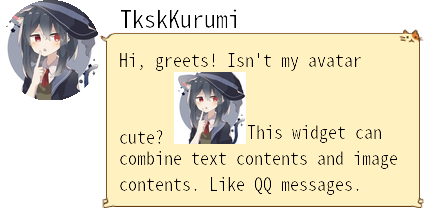
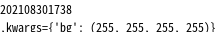
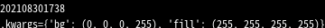

# pilloWidget

PIL Widget, widget style python pillow layouting. Supposed to be used in QQ Bots.

example in example.py



## class color:

My useful color class.

### color.RGB

constructs from RGB, defaulting it's Alpha as 255

### color.RGBA, color HSV, color.HSVA

Like color.RGB, construct color instance.

### color.astuple, tuple(color)

Converts to tuple for PIL.

### color.lighten, color.darken

Returns a *new* color instance that is lighter or darker.

### color.alter, color.alterHSV
`color.alter(R=None,G=None,B=None,A=None)` allows you change one of its channel, it returns a *new* color instance.

`color.alterHSV` if like but it changes color in HSV space.

for example, someRedColor.alterHSV(H=120) is green.

### constants

c_color_*** view in colors.py!

## class widget:

Base class for all widgets.

### get_rendered_contents(self,**kwargs)->list

Renders all contents of the widget.

## class setKwargs(widget):

Will pass kwargs to its child widgets when render.

Other widget will also do this with its attribute, but difference is that setKwargs accepts any parameter when init and other widget only accepts meaningful attributes to it. Like top widget's bg may define all its sub widget's background color if they aren't set.

(But inherited kwargs won't overwrite widget's own attribute. )

### example

```python
def setKwargs_example():
	t=text('content1')
	a=setKwargs(content=t,fill=c_color_BLUE)
	r=row([t,a],bg=c_color_WHITE)
	r.render().save(path.join(result_pth,'setKwargs1.png'))
	#wont overwrite bg's own attribute
	b=setKwargs(content=r,bg=c_color_RED_lighten)
	b.render().save(path.join(result_pth,'setKwargs2.png'))
	#will pass to row renderer because its bg is None
	r.bg=None
	b.render().save(path.join(result_pth,'setKwargs3.png'))
```


### parameters or attributes

#### content (required)

Its content, can be `Image`, `widget`, or `Callable object`.

## Callable contents

Contents of widgets can be a callable object (function).

### example

```python
def callable_content_example():
	def func(**kwargs):
		from datetime import datetime
		return datetime.now().strftime("%Y%m%d%H%M")+"\n,kwargs=%s"%kwargs
	t=text(func)
	t.render(bg=c_color_WHITE).save(path.join(result_pth,'callable_content_example1.png'))
	t.render(bg=c_color_BLACK,fill=c_color_WHITE).save(path.join(result_pth,'callable_content_example2.png'))
```



callable_content_example1.png



callable_content_example2.png

## class row(widget):

Layouts its contents in a row.

### example

```python
def row_example():
	a=text('content1',fill=c_color_RED)
	b=text('content2',fill=c_color_GREEN)
	c=text('content3',fill=c_color_BLUE)
	r=row([a,b,c])
	save_example('row_example',r.render())
```


### parameters or attributes

#### contents (required)

Its contents, list of `Image`, `widget`, or `Callable object`.

#### bg (optional)

Its background color. Can be tuple or pilloWidget color. Defaults to `c_color_TRANSPARENT`

